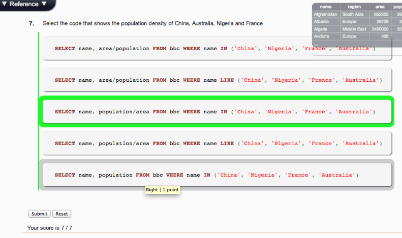

## U3.W7: SQLZoo

####I worked on this challenge [by myself].

### My Quiz Results:

### Reflection

How to Reflect
Reflecting is an incredibly important part of the learning process. It requires you to take a moment and think about what you've learned, what is confusing, and where you need to go. They document your learning process.

Reflections are mandatory for each challenge.

When writing your reflection, write it for an audience. Tell a story of what you tried and what you learned. It will make it easier for you to go back and re-teach yourself or know what you were thinking.

Remember, your reflections aren't just for teachers, they are for your fellow cohort mates to learn from, so be generous! You could end up helping a fellow student learn something new.

Answer the following questions (in addition to the challenge-specific questions) in your reflection:

1)  What parts of your strategy worked? What problems did you face?

I found databases and SQLzoo to be quite a bit to learn at first.  I enjoyed the challenge of learning how to extract and manipulate information from a single database, using SELECT, FROM, WHERE, COUNT(), SUM(), DISTINCT, AND, OR, GROUP BY, HAVING, and more.  I also enjoyed joining these databases together and then accessing and manipulating information contained in these databases.

I found that "letting go" and "feeling" while using logic worked the best for me.  The instructions that I would write tended to "make sense," almost feel right.  It seems like a very direct language.  I know that there is more practice necessary to master and be able to craftfully apply SQL.   

2)  What questions did you have while coding? What resources did you find to help you answer them?

SQL was fairly new, so I watched several videos and read through many of the w3schools' tutorials.  Some came easily and sometimes I got stuck and had to try over and over again, until I found that it was a simply sequencing of commands - two line needed to be reversed.

3)  What concepts are you having trouble with, or did you just figure something out? If so, what?

I learned a tremendous amount, still need to refresh.  I had one difficulty in SUM and COUNT, exercise #8: List the continents with a total population of at least 10 million.  At first I was using, "WHERE SUM(population) >= 10000000."  This keep giving me an error.  I solved this with a "HAVING SUM(population) >= 10000000."  I am not 100% sure why.

4)  Did you learn any new skills or tricks?

A ton of new tricks and skills.  I am refining my SQL

5)  How confident are you with each of the Learning Competencies?

I enjoyed this lesson.  I did have a lot of learning and researching to do.  I can solve most of the challenges, however, I learning the language and its application.

6)  Which parts of the challenge did you enjoy?

I liked writing code that retrieved/manipulated the information requested.  I liked thinking of data tables as linked. 

7)  Which parts of the challenge did you find tedious?

I enjoyed this challenge.  As mentioned, there was quite a bit of new language and structure to learn.  I really didn't find it to be tedious.     
